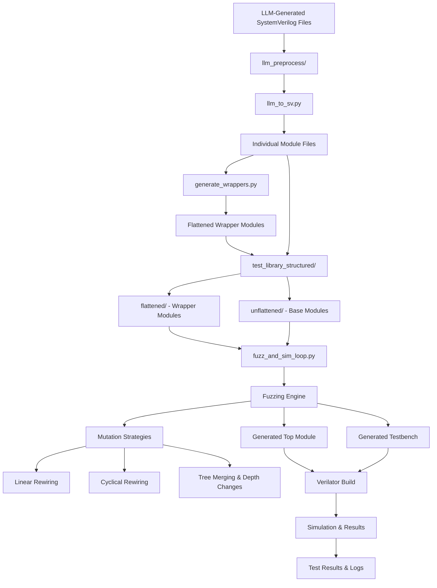

# Module Fuzzing System - Workflow Diagram

## 🔄 Complete Workflow Overview



## 📋 Step-by-Step Process

### **Phase 1: File Preparation**
```
LLM Files → Individual Modules → Wrapper Generation
     ↓              ↓                    ↓
llm_preprocess/ → module_library/ → coverage_library_IO_flattened/
```

### **Phase 2: Library Organization**
```
Wrapper Modules + Base Modules → Structured Test Library
           ↓                              ↓
coverage_library_IO_flattened/ → test_library_structured/
module_library/                    ├── flattened/
                                   └── unflattened/
```

### **Phase 3: Fuzzing & Testing**
```
Structured Library → Fuzzing Engine → Verilator → Results
        ↓                ↓              ↓         ↓
test_library_structured/ → fuzz_state.py → Build → Logs
```

## 🎯 Key Components

### **Input Processing**
- **`llm_to_sv.py`**: Splits multi-module files into individual files
- **`generate_wrappers.py`**: **ESSENTIAL** - Creates flattened wrapper modules with standardized I/O

### **Fuzzing Engine**
- **`fuzz_state.py`**: Core mutation logic and state management
- **`fuzz_and_sim_loop.py`**: Main orchestration and simulation loop
- **`IO_map.py`**: I/O port mapping and wire management

### **Output & Results**
- **Per-cycle results**: Generated modules, testbenches, and simulation logs
- **Error handling**: Comprehensive error logging and recovery
- **Archive system**: Automatic preservation of previous test runs

## 🚀 Quick Start Commands

### **Complete Workflow (Automated)**
```bash
./quick_start.sh
```

### **Manual Step-by-Step**
```bash
# Step 1: Process LLM files
cd llm_preprocess
python3 llm_to_sv.py your_file.sv -o modules -t prefix

# Step 2: Generate wrappers (ESSENTIAL for fuzzing to work)
python3 llm_preprocess/generate_wrappers.py modules/ wrappers/

# Step 3: Organize library
mkdir -p ../test_library_structured/{flattened,unflattened}
cp wrappers/*.sv ../test_library_structured/flattened/
cp modules/*.sv ../test_library_structured/unflattened/

# Step 4: Run fuzzing
cd ../rewiring
python3 fuzz_and_sim_loop.py /opt/module-fuzz/rewiring/test_library_structured/flattened -o /opt/module-fuzz/rewiring/results/ -t top -m 10 -c 5 --incdir /opt/module-fuzz/rewiring/test_library_structured/unflattened/ --incdir /opt/module-fuzz/rewiring/test_library_structured/flattened/
```

## 📊 Data Flow

```
Input Files → Processing → Wrappers → Library → Fuzzing → Results
     ↓           ↓          ↓         ↓         ↓         ↓
LLM .sv → Split Files → Flattened → Structured → Mutate → Logs
     ↓           ↓          ↓         ↓         ↓         ↓
Multi-mod → Individual → Standard → Test Lib → Simulate → Archive
```

## 🔧 Configuration Points

### **File Locations**
- **LLM Input**: `llm_preprocess/*.sv`
- **Processed Modules**: `llm_preprocess/module_library/`
- **Generated Wrappers**: `coverage_library_IO_flattened/`
- **Final Library**: `test_library_structured/`
- **Test Results**: `rewiring/runs_tb/`

### **Key Parameters**
- **Mutations per cycle**: `-m` flag in fuzzing command
- **Number of cycles**: `-c` flag in fuzzing command
- **Testbench cycles**: `--tb-cycles` flag
- **Include directories**: `--incdir` flags for module resolution

## 🎉 Success Indicators

### **Phase 1 Success**
- Individual `.sv` files created in `module_library/`
- Wrapper modules generated in `coverage_library_IO_flattened/`

### **Phase 2 Success**
- `test_library_structured/` contains both `flattened/` and `unflattened/` subdirectories
- Files are properly organized and accessible

### **Phase 3 Success**
- Fuzzing engine runs without errors
- Verilator builds and simulations complete successfully
- Results are saved in output directory with proper logging

## 🚨 Common Issues & Solutions

### **Module Resolution Errors**
- **Problem**: Verilator can't find module definitions
- **Solution**: Ensure `--incdir` paths include both `flattened/` and `unflattened/` directories

### **Build Failures**
- **Problem**: Verilator compilation errors
- **Solution**: Add `--Wno-MODDUP --Wno-WIDTHTRUNC` to `--verilator-flags`

### **Permission Issues**
- **Problem**: Cannot create or access directories
- **Solution**: Check file permissions and ensure write access to output directories

### **Missing Wrapper Generation**
- **Problem**: Fuzzing fails because modules aren't properly flattened
- **Solution**: **ALWAYS run `generate_wrappers.py`** after splitting modules - this is essential for the fuzzer to work

## 🔑 Critical Requirements

### **Wrapper Generation is MANDATORY**
The fuzzing system **cannot work** without properly generated wrapper modules. The `generate_wrappers.py` script:
- Creates standardized I/O interfaces (`in_flat`, `out_flat`)
- Enables the fuzzer to manipulate module connections
- Provides consistent port mapping across all modules
- **Must be run** after `llm_to_sv.py` and before fuzzing

### **Mutation Strategies Explained**
- **Linear Rewiring**: Sequential module connections and mutations
- **Cyclical Rewiring**: Creates and resolves combinational loops
- **Tree Merging**: Combines module trees for complex topologies
- **Depth Changes**: **Result from mutations**, not a separate strategy

---

**This workflow ensures a systematic approach from raw LLM-generated files to comprehensive fuzzing tests with proper error handling and result preservation. Remember: wrapper generation is essential for the system to function!**
